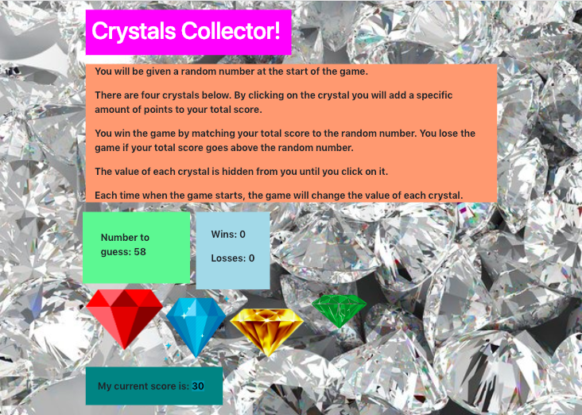

# Building a Crystal Game

> This is a randomized number guessing game. You must try to guess a number by clicking on the crystals, in order to win. If you attain the number, you win! If you click too many crystals and go over the goal number, you lose and can try again.

A HTML/CSS/Javascript/Jquery project for the UMN Coding Bootcamp, Assignment 4. 

## Accessible at:

 https://hannahschuelke.github.io/unit-4-game/

## Author

Hannah Schuelke – hannah.r.schuelke@gmail.com
